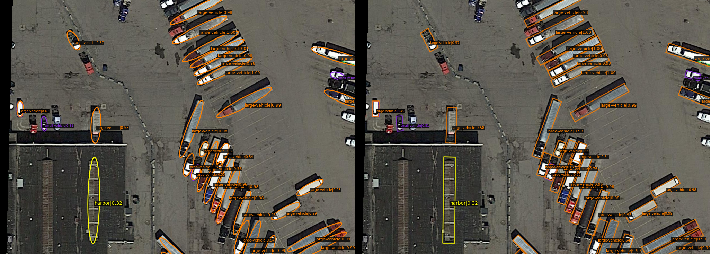

<div align="center">
<h2> [CVPR2025] GauCho: Gaussian Distributions with Cholesky Decomposition for Oriented Object Detection </h2>

Jeffri Murrugara-Llerena<sup>\*</sup><sup>1</sup>&nbsp;
José Henrique Lima Marques<sup>\*</sup><sup>2</sup>
Cláudio R. Jung<sup>2</sup>&nbsp;

<sup>1</sup> Computer Science Department,
Stony Brook University&nbsp;<sup>2</sup> Institute of Informatics,
Federal University of Rio Grande do Sul

<sup>\*</sup> First authors

</div>

[[`Paper`](https://arxiv.org/abs/2502.01565)] [[`Project`](https://github.com/jhlmarques/cvpr2025-gaucho/tree/main)] [[`BibTeX`](#citation)]

**Gaucho** detects oriented objects with typical representations or Oriented ellipses. It relies in a novel regression head designed to directly predict Gaussian distributions based on the Cholesky matrix decomposition, which teorically mitigates the discontinuity problem.



## Abstract
Oriented Object Detection (OOD) has received increased attention in the past years, being a suitable solution for detecting elongated objects in remote sensing analysis. In particular, using regression loss functions based on Gaussian distributions has become attractive since they yield simple and differentiable terms. However, existing solutions are still based on regression heads that produce Oriented Bounding Boxes (OBBs), and the known problem of angular boundary discontinuity persists. In this work, we propose a regression head for OOD that directly produces Gaussian distributions based on the Cholesky matrix decomposition. The proposed head, named GauCho, theoretically mitigates the boundary discontinuity problem and is fully compatible with recent Gaussian-based regression loss functions. Furthermore, we advocate using Oriented Ellipses (OEs) to represent oriented objects, which relates to GauCho through a bijective function and alleviates the encoding ambiguity problem for circular objects. Our experimental results show that GauCho can be a viable alternative to the traditional OBB head, achieving results comparable to or better than state-of-the-art detectors for the challenging dataset DOTA. Our code will be available at *\[this repository\]*.

## Install
**Note: Some older Pytorch versions have a significantly slower implementation of the eigendecomposition functions, and should thus be avoided**

### Conda
```
# Create environment
conda create --name gaucho python=3.8 -y
conda activate gaucho

# Install pytorch
conda install pytorch==1.11.0 torchvision==0.12.0 cudatoolkit=11.3.1 -c pytorch

# Install MMCV and MMDetection using MIM
pip install -U openmim
mim install mmcv-full
mim install mmdet\<3.0.0

# Install mmrotate-gaucho
cd mmrotate-gaucho
pip install -e .

```

### Docker

```
# Build the provided image
docker build -t cvpr2025-gaucho .

# Run
docker run --gpus all --shm-size=8g -it -v {DATA_DIR}:/cvpr2025-gaucho/data cvpr2025-gaucho
```


## Train/Test

Model config files are separated in a *baseline* and *gaucho* folder. Training and testing can be done using the default [mmrotate scripts](https://mmrotate.readthedocs.io/en/latest/get_started.html#train-a-model). 

***Example: Train GauCho FCOS with ProbIoU loss on DOTA 1.0***
```
python tools/train.py \ 
    configs_gaucho/gaucho_anchorless_dotav1/gaussian_fcos_r50_fpn_gaucho_probiou_1x_dota_le90.py
```

***Example: Evalute GauCho FCOS***
```
python tools/test.py \
    configs_gaucho/gaucho_anchorless_dotav1/gaussian_fcos_r50_fpn_gaucho_probiou_1x_dota_le90.py \
    path_to_checkpoint \
    --eval mAP

```

We also provide simple shell scripts for mass-training / testing configuration files.

***Example: Train all baseline anchor-based detectors on HRSC2016 with KLD***
```
./train_configs configs_baseline/gaucho_one_stage_baseline_hrsc kld
```


## Citation

If you use this model in your research, please consider citing:

```
@misc{murrugarrallerena2025gauchogaussiandistributionscholesky,
      title={GauCho: Gaussian Distributions with Cholesky Decomposition for Oriented Object Detection}, 
      author={Jeffri Murrugarra-LLerena and Jose Henrique Lima Marques and Claudio R. Jung},
      year={2025},
      eprint={2502.01565},
      archivePrefix={arXiv},
      primaryClass={cs.CV},
      url={https://arxiv.org/abs/2502.01565}, 
}
```

## Acknowledgements

Our codebase is built upon the [MMRotate benchmark](https://github.com/open-mmlab/mmrotate). Huge thanks to the OpenMMLab team and their contributors!

```
@inproceedings{zhou2022mmrotate,
  title   = {MMRotate: A Rotated Object Detection Benchmark using PyTorch},
  author  = {Zhou, Yue and Yang, Xue and Zhang, Gefan and Wang, Jiabao and Liu, Yanyi and
             Hou, Liping and Jiang, Xue and Liu, Xingzhao and Yan, Junchi and Lyu, Chengqi and
             Zhang, Wenwei and Chen, Kai},
  booktitle={Proceedings of the 30th ACM International Conference on Multimedia},
  year={2022}
}
```

## To-do:
- [ ] Reorganize code to better fit MMRotate organization standards
